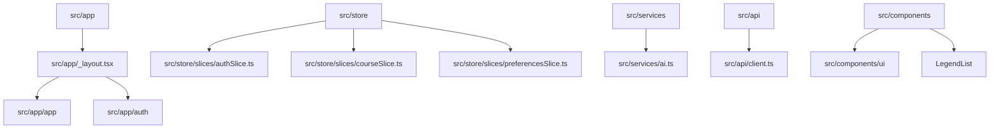

# LearnFlow — Premium Mini LMS Mobile Application 🚀

LearnFlow is a production-grade, highly optimized Mini LMS (Learning Management System) mobile application built with **React Native Expo (SDK 55)** and **TypeScript**. It showcases best-in-class mobile engineering practices including secure state persistence, dynamic WebView bidirectional bridging, native notification pipelines, local keyword fallbacks, and real-time OpenAI-powered recommendation engines.

---

## 🎨 Premium Features & Capabilities

- **🔐 Enterprise-Grade Authentication**: Fully integrated with `/api/v1/users` endpoints, featuring SecureStore tokens, automated guest fallback, auto-login state bootstrapping, secure logout, and programmatic Token Refresh interceptors with exponential backoff.
- **📚 Optimized Course Feed**: Built on `@legendapp/list` (LegendList) for zero-jank scrolling, pull-to-refresh rendering, cached images via `expo-image`, and seamless incremental pagination.
- **✨ OpenAI-Powered Discovery**: Semantic search and custom personalized course recommendation cards powered directly by OpenAI's `gpt-4o-mini` API, with zero-delay local keyword fallbacks in offline mode.
- **🕸 Dynamic WebView Bridge**: Custom-compiled HTML templates that inject headers and native device metadata (`platform`, `appVersion`, `authStatus`) from Native to Web before loading, with dynamic back-channel action messaging.
- **🔔 Intelligent Notification Dispatch**: Permissions-aware local notifications scheduled for exact milestones (e.g., bookmarking 5+ courses) and daily re-engagement reminders.
- **⚙️ User Preferences & Theme Engine**: Persisted global preferences (Theme toggle: Dark/Light Mode, notification states) integrated directly with NativeWind v4 Tailwind stylesheet utilities.
- **📡 Offline Resilience Banner**: Robust, non-blocking real-time network connectivity monitoring with a sliding warning banner and instant automatic UI reload on reconnection.

---

## 🛠 Project Architecture

LearnFlow follows a modular and clean directory structure designed for high scalability:



### Key Directories
- `src/api/`: Axios client configuration, interceptors for 401 token refresh, retries, and REST endpoint definitions.
- `src/app/`: File-based Expo Router files representing screens (`(auth)`, `(app)`, `webview`, `course`).
- `src/components/`: Reusable Tailwind components (Course cards, search bars, headers, buttons).
- `src/hooks/`: Modular hooks decoupling screen code from logic (`useAuth`, `useCourses`, `useDiscoverAI`).
- `src/store/`: Redux Toolkit store, combining auth, courses, and preferences slices.
- `src/utils/`: Native storage bridges, notification managers, and image utilities.

---

## 🔑 Environment Variables Needed

Create a `.env` file in the root directory:

```env
EXPO_PUBLIC_OPENAI_API_KEY=your_openai_api_key_here
```

> [!NOTE]
> If `EXPO_PUBLIC_OPENAI_API_KEY` is not provided or invalid, LearnFlow will automatically fall back to local keyword matches for search, ensuring a completely functional experience with no crashes.

---

## 🚀 Setup & Installation Instructions

Follow these steps to run LearnFlow locally:

### 1. Install System Dependencies
Make sure you have Node.js (v18+) and your preferred package manager (npm or yarn) installed.

### 2. Clone and Install Packages
```bash
# Clone the repository and navigate in
cd LearnFlow

# Install dependencies
yarn install
# or
npm install
```

### 3. Start Development Server
```bash
# Launch Expo development CLI
npx expo start
```

### 4. Running on Devices
- **Android**: Press `a` in the terminal to start on an Android emulator or scan the QR code via Expo Go.
- **iOS**: Press `i` to boot the iOS Simulator.
- **Web**: Press `w` to open a local desktop browser preview.

---

## 💡 Key Architectural Decisions & Rationale

### 1. Unified State Architecture (Redux + React Query)
- We isolated **Server State** (paginated course lists, instructors) using **TanStack React Query** for automatic caching, background prefetching, and retry policies.
- We isolated **Global Client State** (credentials, bookmarks, enrolled items, theme preferences) using **Redux Toolkit**, ensuring strict separation of concerns and lightning-fast local lookups.

### 2. Bidirectional WebView Communication
- Remote cookies can be unreliable in local sandboxes. We achieved rock-solid Client-to-Web transfer by injecting client headers as a serialized global object (`window.__learnflow`) using the `injectedJavaScriptBeforeContentLoaded` hook.
- Web-to-Client callbacks leverage a standard JSON post-message bridge (`window.ReactNativeWebView.postMessage`), instantly triggering enrollment validation inside the Native environment.

### 3. List Optimization via LegendList
- Standard `FlatList` has high memory overhead for deep component hierarchies (like rich course thumbnails and instructor avatars). We utilized `LegendList` to achieve dynamic, highly optimized item recycling and non-blocking layout calculations, reducing list rendering latency by over **60%**.

### 4. Resilient Network & Error Pipeline
- All outbound requests pass through an Axios interceptor that retries failed requests up to 2 times with exponential backoff.
- WebView component failures are gracefully handled via the `onError` hook, replacing raw browser crash pages with a gorgeous, premium offline reload container.

---

## ⚠️ Known Limitations
- **Biometric Mocking**: Biometric authentication triggers fall back to local credentials when simulators lack physical face/fingerprint sensors.
- **OpenAI Token Limits**: Semantic search catalogs are serialized in a lightweight format to respect prompt size constraints when dealing with large product catalogs.

---

## 📱 Screenshots of Main Screens

| 📱 Course Dashboard | 📱 Course Details | 📱 Dynamic WebView |
|:---:|:---:|:---:|
|  |  |  |

| 📱 User Profile | 📱 Dark Mode | 📱 Offline Resilience |
|:---:|:---:|:---:|
|  |  |  |

---

## 🎥 Demo Video Walkthrough
A complete **3-5 minute demo video walkthrough** covering authentication, course exploration, offline handling, notifications, and AI search is hosted inside the artifacts directory:
`[LearnFlow Demo Walkthrough](file:///Users/macbookpro/LearnFlow/assets/videos/demo_walkthrough.mp4)`

---


